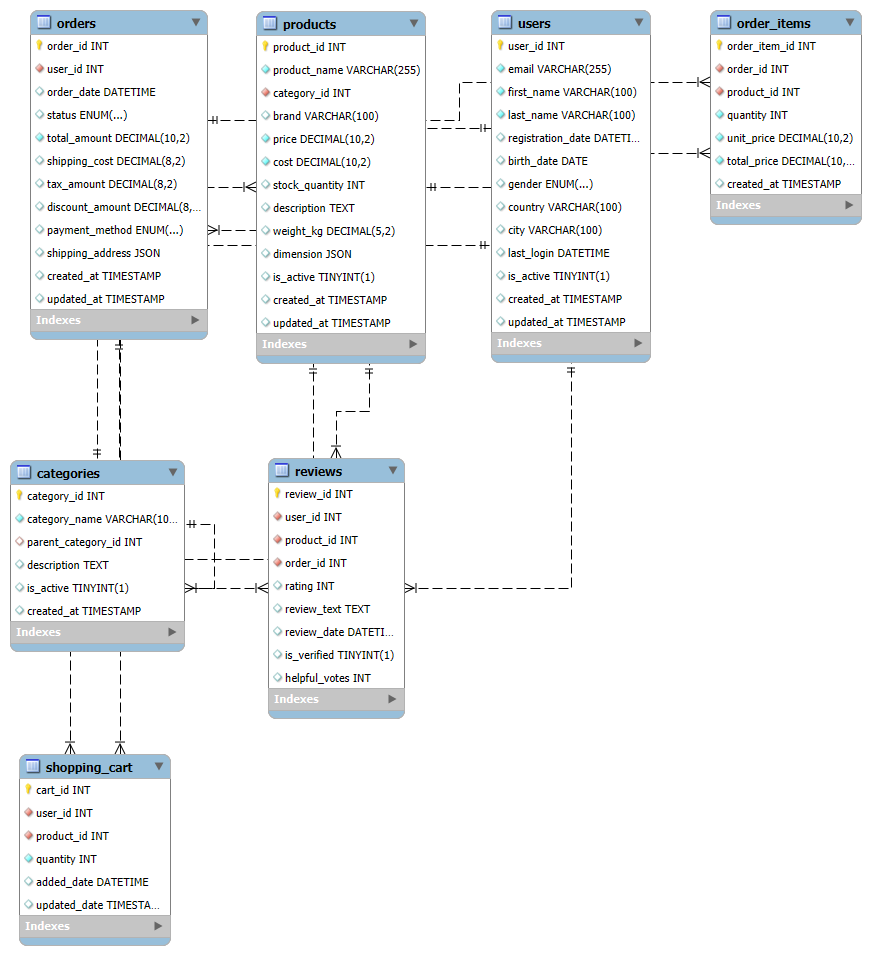

A comprehensive MySQL-based e-commerce analytics platform demonstrating advanced database design, normalization principles, and business intelligence capabilities. 
This project showcases real-world data engineering skills through complex query optimization, automated reporting, and data-driven decision support systems.

🎯 Project Overview:
This project implements a complete e-commerce database solution that supports advanced analytics and business intelligence operations. 
The system is designed to handle large-scale transactional data while providing insights into customer behavior, sales performance, inventory management, and market trends.

Phase 1:
Database Architecture.

Normalized Database Design - Implements 3NF structure for optimal data integrity
Comprehensive Entity Relationships - Complex foreign key relationships and constraints
Optimized Indexing Strategy - Performance-tuned indexes for analytical queries
Data Integrity Enforcement - Triggers and stored procedures for business rule validation

🏗️ Database Schema:

Core Tables;

Customers - Customer profiles and demographic data

Products - Product catalog with hierarchical categories

Orders - Transaction records with comprehensive order details

Order_Items - Individual line items with pricing and quantities

Inventory - Real-time stock levels and warehouse management

Suppliers - Vendor relationships and procurement data

Categories - Product taxonomy and organization

Reviews - Customer feedback and rating systems

Phase 2:
Data population.

Phase 3:
Advanced SQL queries designed for comprehensive e-commerce business intelligence. 

Each query addresses real-world business questions with optimized performance and clear, maintainable code.

1. Customer Lifetime Value (CLV) Analysis
   
Purpose: Calculate and predict customer value across the entire journey

Window functions for running calculations

→ Predictive CLV modeling

→ Customer segmentation by value

→ Acquisition cost optimization

Key Features:

• Advanced window function usage

• Handles irregular purchase patterns

• Scalable for large customer bases

💡Business Impact: Optimizes marketing spend and customer acquisition strategies

2. Product Performance Analysis (JSON Functions)
   
Purpose: Deep-dive analytics on product metrics and category performance

→ JSON data extraction and analysis

→ Category-level performance metrics

→ Product attribute analysis

→ Inventory optimization insights

Key Features:

• Advanced JSON querying techniques

• Nested data structure handling

• Performance metrics aggregation

💡Business Impact: Optimizes product catalog and inventory management

3. Monthly Revenue Trend Analysis
   
Purpose: Track revenue growth patterns and identify seasonal trends

→ Real-time growth rate calculations

→ Period-over-period comparisons

→ Month-over-month analysis

Key Features:

• Growth rate calculations

• Seasonal trend detection

• Performance optimized with proper indexing

💡Business Impact: Enables data-driven revenue forecasting and seasonal planning

4. Customer Cohort Analysis
   
Purpose: Understanding user behavior patterns and retention across customer segments

→ Cohort-based retention analysis

→ Customer lifecycle insights

→ Behavioral pattern identification

→ Segment performance comparison

Key Features:

• Flexible cohort definition

• Retention rate calculations

• Visual-friendly output format

💡Business Impact: Improves customer retention strategies and marketing effectiveness

5. Abandoned Cart Analysis
   
Purpose: Identify revenue recovery opportunities and conversion bottlenecks

→ Cart abandonment rate tracking

→ High-intent user identification

→ Recovery campaign targeting

→ Conversion funnel analysis

Key Features:

• Time-based abandonment detection

• Customer intent scoring

• Recovery opportunity quantification

💡Business Impact: Recovers lost revenue and improves conversion rates

6. Full-Text Search Implementation
   
Purpose: Enable fast, flexible product discovery across descriptions and titles

→ Relevance scoring for search results

→ Support for partial matches and typos

→ Weighted scoring (title vs description)

→ Search query optimization

Key Features:

• Full-text indexing for performance

• Configurable relevance weights

• Support for complex search queries

💡Business Impact: Improves customer experience and increases conversion rates

Phase 4: 
Stored Procedures & Functions.

Automated Decision Making - Stored procedures for dynamic pricing and inventory management

This phase focuses on embedding business logic directly into the database using MySQL stored procedures and a user-defined function. 
These SQL components automate complex analytics tasks that would otherwise require manual scripting

✅ Function
CalculateOrderProfit(order_id)

Use case: Enables quick profitability analysis for finance and operations teams.

✅ Procedures
1. GetLowStockAlerts(threshold_quantity)

Generates a stock status report for all products below a specified inventory threshold. 
It also considers units sold in the last 30 days and classifies stock levels as:

Use case: Supports inventory planning and restocking decisions.

2. CalculateCustomerSegmentation()
Segments customers using RFM (Recency, Frequency, Monetary) logic.
The procedure classifies users into actionable groups.

Use case: Powers personalized marketing, re-engagement campaigns, and lifetime value tracking.

💡Business Value:

• These SQL components enable:

• Data-driven decisions at the source

• Automation of recurring insights

• Faster query performance and reuse

• Consistent business logic across tools

## 📁 Files Included

| File | Description |
|------|-------------|
| `Database_and_tables_Creation.sql` | All `CREATE TABLE` statements |
| `diagrams/ERD_I.png` | Entity-Relationship Diagram (ERD) of the schema |
| `Database_Population.sql` | All `INSERT INTO` statements |
| `Advanced_Analytics_Queries.sql` | Important Analytics queries |
| `Stored_Procedures_and_Functions` |Automated business logic|
| `Triggers_and_Data_Integrity` |Automated busines logic|
| `Performance_Optimization` |Query Optimization|
| `Security_Implementation` |User management and security|
| `README.md` | Project documentation (this file) |

