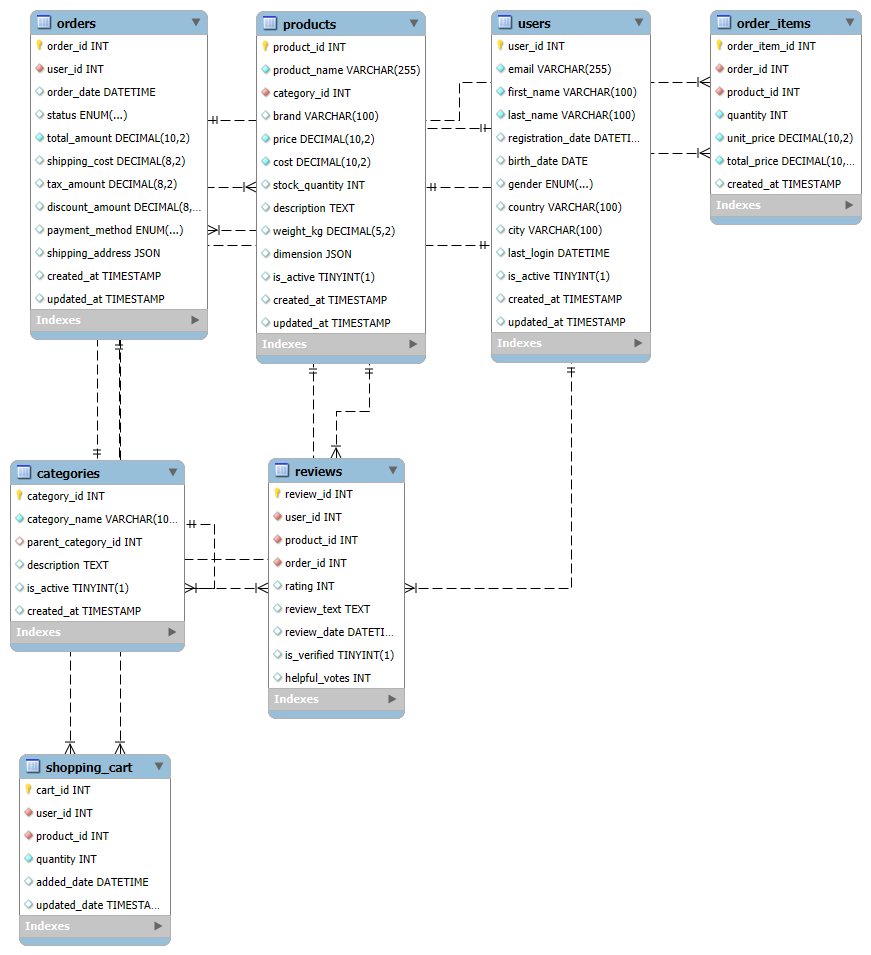

# 🛒 E-Commerce Analytics Platform (MySQL-Based)

## 📌 Overview

A comprehensive MySQL-based e-commerce analytics platform demonstrating advanced database design, normalization principles, and business intelligence capabilities.
This project showcases real-world data engineering skills through complex query optimization, automated reporting, and data-driven decision support systems.

---

## Key Features

- Advanced SQL for business intelligence  
- Automated reporting and insights  
- Fully normalized schema (3NF)  
- Stored procedures and functions for logic automation  
- Real-time analytics and performance tuning  
- Role-based access control  

---

## 🚀 Project Phases

### Phase 1: Database Architecture

- **Normalized Design (3NF):** Ensures data consistency and avoids redundancy  
- **Entity Relationships:** Complex foreign key relationships and constraints  
- **Indexing Strategy:** Performance-tuned indexes for analytics  
- **Data Integrity:** Triggers and stored procedures for business rules  

#### Core Tables

- `Customers`: Customer profiles and demographic data  
- `Products`: Product catalog with hierarchical categories  
- `Orders`: Transaction records with full order details  
- `Order_Items`: Line items with quantity and pricing  
- `Inventory`: Real-time stock levels and warehouse data  
- `Suppliers`: Vendor and procurement information  
- `Categories`: Product taxonomy  
- `Reviews`: Customer feedback and rating system  

---

### Phase 2: Data Population

Realistic mock data is inserted into the schema to simulate real-world e-commerce operations.

---

### Phase 3: Advanced SQL Analytics

#### 1. Customer Lifetime Value (CLV) Analysis

- Calculate and predict customer value  
- Use window functions for segmentation and forecasting  
**💡 Business Impact**: Optimizes marketing spend and lifetime value strategies

#### 2. Product Performance Analysis (JSON Functions)

- Analyze product performance using JSON attributes  
- Extract nested data and compute performance metrics  
**💡 Business Impact**: Informs catalog optimization and inventory planning

#### 3. Monthly Revenue Trend Analysis

- Track month-over-month revenue growth  
- Compare seasonal trends and YoY performance  
- **💡 Business Impact**: Supports forecasting and financial planning

#### 4. Customer Cohort Analysis

- Understand retention and lifecycle behavior  
- Perform segment comparison over time  
**💡 Business Impact**: Enhances customer retention strategies

#### 5. Abandoned Cart Analysis

- Identify abandonment rate and recovery opportunities  
- Score high-intent users and funnel drop-offs  
**💡 Business Impact**: Recovers lost revenue and improves conversions

#### 6. Full-Text Search Implementation

- Implement full-text search for product discovery  
- Support relevance scoring, typos, and weighted results  
**💡 Business Impact**: Improves user experience and conversion rates

---

### Phase 4: Stored Procedures & Functions

#### ✅ Function: `CalculateOrderProfit(order_id)`
- Returns profit for a specific order  
- **Use case**: Quick profitability insights for finance and ops teams

#### ✅ Procedure: `GetLowStockAlerts(threshold_quantity)`
- Generates stock alerts based on custom thresholds  
- Considers recent sales for smarter inventory restocking  
- **Use case**: Supports procurement and supply chain teams

#### ✅ Procedure: `CalculateCustomerSegmentation()`
- Segments customers using RFM (Recency, Frequency, Monetary) analysis  
- **Use case**: Enables personalized marketing and campaign targeting

**💡 Business Value:**
- Embedded logic allows reusable and consistent decision-making  
- Enables automation and improved query performance  
- Centralizes business rules directly in the data layer  

---

### Phase 5: Data Integrity & Automation

✅ **Smart Inventory Management:** Updates stock levels after each purchase  
✅ **Order Tracking:** Logs each status change for full auditability  
✅ **Review Verification:** Ensures only verified buyers leave reviews  

---

### Phase 6: Performance Optimization

- **Query Tuning**: Uses `EXPLAIN` plans to identify bottlenecks  
- **Optimized Indexing**: Supports high-volume transaction querying  
- **Real-Time Syncing**: Ensures immediate data consistency across modules  

---

### Phase 7: Security & Access Control

**Role-Based Permissions:**

- **Analytics User:** Can view reports and dashboards  
- **Sales User:** Access to customer and order insights  
- **Admin User:** Full control over system configuration and access

---

### Final Sprint: (Phases 8–10)

### Phase 8: Advanced Analytics & Reporting
Delivered comprehensive business intelligence capabilities, including:
- RFM (Recency, Frequency, Monetary) analysis for customer segmentation
- Product Recommendation Engine using Market Basket Analysis
- Seasonal Sales Analysis to identify demand patterns
- Customer Churn Prediction to flag at-risk customers
- Consolidated business reports covering sales, customers, and inventory

💡 **Business Impact:** Enhanced customer retention strategies, optimized product offerings, and supported data-driven marketing decisions.

---

### Phase 9: Advanced MySQL 8.0 Features
Leveraged MySQL 8.0’s modern capabilities to handle complex analytical needs:
- Window functions for advanced metrics such as running totals and moving averages
- CTEs for hierarchical queries (base case: top-level categories; recursive case: subcategories)
- JSON aggregation for multi-level performance reporting
- Ranking functions to order and prioritize results

💡 **Business Impact:** Produced efficient, maintainable, and scalable queries capable of analyzing large datasets.

---

### Phase 10: Performance Monitoring & Optimization
Implemented measures to ensure the database remains performant at scale:
- Query performance analysis and diagnostics procedure
- Index creation and tuning for critical queries
- Monitoring views for table sizes and index usage

💡 **Business Impact:** Reduced query execution time, improved resource efficiency, and maintained long-term database stability.

---

## 📁 File Structure

| File/Folder | Description |
|-------------|-------------|
| `Database_and_tables_Creation.sql` | All `CREATE TABLE` statements |
| `diagrams/ERD_I.png` | Entity-Relationship Diagram |
| `Database_Population.sql` | Mock data insertions |
| `Advanced_Analytics_Queries.sql` | Business intelligence SQL queries |
| `Stored_Procedures_and_Functions.sql` | Business logic automation |
| `Triggers_and_Data_Integrity.sql` | Triggers for maintaining data integrity |
| `Performance_Optimization.sql` | Query tuning and indexing strategy |
| `Security_Implementation.sql` | User roles and permissions |
| `README.md` | Project documentation (this file) |

---

## ERD Diagram

---

## Technologies Used

- **MySQL**: Core database engine  
- **SQL**: For queries, views, functions, and procedures  
- **JSON Functions**: For nested data handling  
- **ERD Tools**: dbdiagram.io / drawSQL  
- **Git**: Version control and collaboration  

---

## 👩🏾‍💻 Author

**Esther Mamtoshu**  
Senior Data Analyst | Data Scientist | Data Storyteller | ML Enthusiast  
🔗 [LinkedIn](http://linkedin.com/in/esther-mamtoshu-520595119)  
🌐 [Portfolio](https://www.datascienceportfol.io/EstherMwangi)

---

## 📌 Credits

This project is a self-driven case study inspired by real-world e-commerce systems.  
All schema design, analytics, and logic were developed from scratch with the help of AI to demonstrate practical SQL engineering capabilities.

